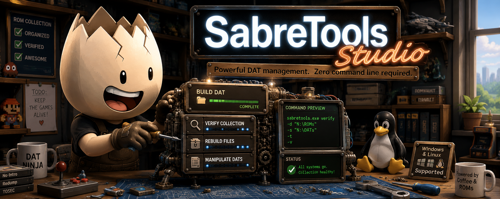
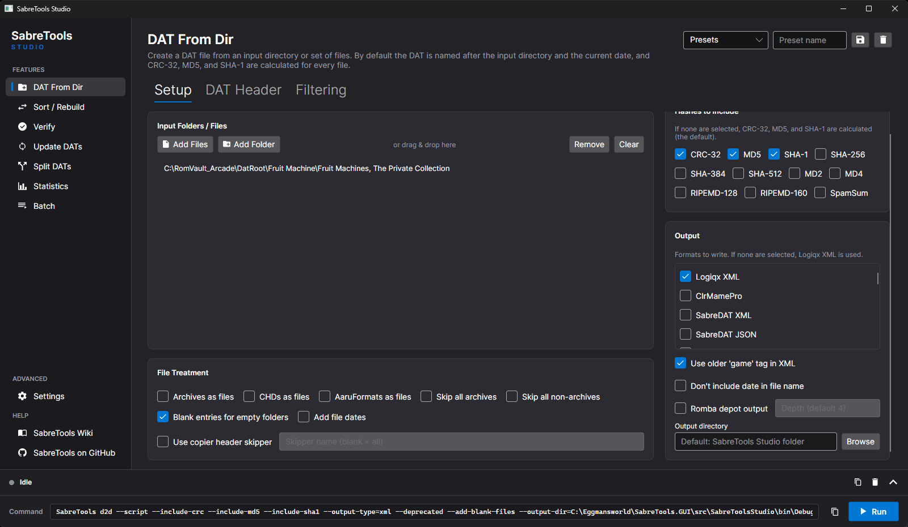
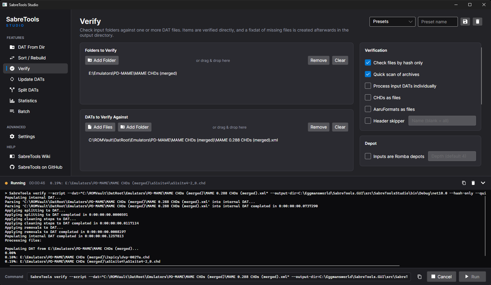

# SabreTools Studio



**A graphical front-end for the SabreTools DAT manager, for Windows and Linux.**

SabreTools Studio puts the most-used features of the SabreTools command line tool behind a
clean, modern interface. If you manage ROM collections with tools like RomVault, you already
know the workflow: build DATs from folders, verify collections against DATs, rebuild files
into standardized archives, and manipulate the DAT files themselves. Studio does all of that
without you having to memorize a single command line flag — while *showing* you the exact
command it runs, so you can learn the CLI as you go if you want to.

> **Important:** Studio is an unofficial companion to [SabreTools](https://github.com/SabreTools/SabreTools),
> which is written and maintained by Matt Nadareski. Studio is not affiliated with or endorsed
> by the SabreTools project. For complete documentation of every feature and option, read the
> [SabreTools Wiki](https://github.com/SabreTools/SabreTools/wiki) — it is the authoritative
> reference, and both links are available inside the app under **Help** in the left sidebar.

---

## What's in the box

A Studio installation is just one folder:

```
SabreToolsStudio.exe        <- the application (self-contained; no .NET install needed)
SabreToolsStudio.config     <- created on first use; all your settings and presets
sabretools\                 <- the bundled SabreTools command line tool that does the real work
```

Studio is **fully portable**. It never touches the Windows registry, your user profile, or
temp folders. Copy the folder to another machine or a USB stick and everything — including
your saved presets — goes with it. Any output (DATs, fixdats, reports) lands in this same
folder by default, unless you choose an output directory on the feature page.

## Features

| Page | What it does |
| ---- | ------------ |
| **DAT From Dir** | Scan a folder of ROMs (loose files or archives) and create a DAT from it, with your choice of hashes (CRC-32 up to SHA-512 and more) and full control of the DAT header fields. |
| **Sort / Rebuild** | Rebuild files into organized sets based on a DAT. Output to plain folders, **TorrentZip**, **Zstandard Zip**, TorrentGZ (Romba depots), or TAR. |
| **Verify** | Check folders against one or more DATs. Anything missing is written out as a **fixdat**, ready to share or fill. |
| **Update DATs** | The multitool: convert between DAT formats, merge with deduplication, diff DATs against each other or a base set, apply 1G1R filtering, clean names, and much more. |
| **Split DATs** | Split DATs by extension, best-available hash, file size, total game size, or item type. |
| **Statistics** | Game/rom counts, total sizes, and hash coverage for any DATs, output as text, CSV, HTML, SSV, or TSV. |
| **Batch** | Run SabreTools batch scripts, and build them visually: add steps, fill in arguments, watch the live script preview, save, run. |

Every option in the app carries a hover tooltip explaining what it does, sourced from the
SabreTools documentation, so you rarely need to leave the app to understand a setting.


*Building a DAT from a folder. The command bar along the bottom always shows the exact
SabreTools command that will run.*

### Not everything is in the GUI

Studio covers the seven primary SabreTools features listed above, but it is **not** a
complete replacement for the command line tool. SabreTools offers additional switches,
special values, and behaviors that Studio does not expose. If you need something you can't
find in the app, check the [SabreTools Wiki](https://github.com/SabreTools/SabreTools/wiki)
and run the bundled CLI directly from the `sabretools` folder — the command preview bar in
Studio is a great starting point for building your own commands.

## Zstandard archive support

If your collections are compressed with **Zstandard zips** (as produced by RomVault's ZSTD
mode or 7-Zip-Zstandard), Studio's bundled SabreTools build reads them natively for
scanning, verification, and rebuilding. On the Sort/Rebuild page you can also **write**
Zstandard zips, or recompress a zstd collection to standard TorrentZip. Zstandard zips created
by Studio are NOT deterministic and NOT the same as RVZSTD zips created within RomVault. 
Note that plain 7-Zip cannot open zstd archives — use 7-Zip-Zstandard
(https://github.com/mcmilk/7-Zip-zstd)

## Using the app

1. **Pick a feature** in the left sidebar.
2. **Add your inputs** — click the Add buttons or just drag and drop files/folders onto the lists.
3. **Set your options.** Hover anything you're unsure about. Options that don't apply to
   your current selections are disabled automatically, so you can't build an invalid command.
4. **Watch the command bar** at the bottom — it always shows the exact SabreTools command
   Studio will run. The copy button puts it on your clipboard.
5. **Click Run.** The log drawer slides up and streams the tool's output live. Collapse it
   with the chevron; it stays out of your way as a one-line status strip. You can cancel a
   running operation at any time.


*A verification in progress: the log drawer slides up automatically and streams SabreTools'
output live, with elapsed time in the status strip and a Cancel button in the command bar.*

Tips worth knowing:

- **Presets:** every feature page has a preset bar at the top right. Type a name and hit the
  save button to store the page's entire setup (including input lists); pick it from the
  dropdown to restore it later. Presets live in `SabreToolsStudio.config`.
- **Log paths:** highlight any file or folder path in the log, right-click, and choose
  **Open in File Explorer** to jump straight to it.
- **Your own SabreTools:** by default Studio uses its bundled copy, but you can point it at
  any other SabreTools executable under **Settings**.
- **Theme:** follows your OS light/dark preference; override it under **Settings**.

## Requirements

- **Windows:** Windows 10/11 x64. Nothing else — the app is self-contained.
- **Linux:** x64 with an X11 or Wayland desktop. Mark the binary executable after copying
  (`chmod +x SabreToolsStudio`).

## Building from source

You need the .NET 10 SDK and a checkout of the
[Eggmansworld/SabreTools fork](https://github.com/Eggmansworld/SabreTools) sitting next to
this repository (`../SabreTools`), on the **`zstd-support`** branch. The fork carries the
Zstandard read/write patches that Studio's bundled CLI depends on; building against the
upstream SabreTools repository produces a CLI without Zstandard support.

```
git clone -b zstd-support https://github.com/Eggmansworld/SabreTools.git ../SabreTools
cd ../SabreTools && git submodule update --init && cd ../SabreToolsStudio

# Publish the SabreTools CLI into tools/sabretools (bundled with the GUI)
./build-cli.ps1        # Windows
./build-cli.sh         # Linux

# Build and run the GUI
dotnet run --project src/SabreToolsStudio
```

### Distributable builds

Self-contained single-file builds, ready to zip and share:

```
./publish-win.ps1      # -> dist/win-x64
./publish-linux.sh     # -> dist/linux-x64
```

Each script bundles a self-contained SabreTools CLI for the target platform, so the output
folder works on machines with no .NET runtime installed.

## Credits and license

- **SabreTools** is by Matt Nadareski — [github.com/SabreTools/SabreTools](https://github.com/SabreTools/SabreTools) (MIT license)
- **SabreTools Studio** GUI by Eggman, built with Anthropic's Claude Fable 5 High, using [Avalonia UI](https://avaloniaui.net/) (MIT license)
- TorrentZip/zip handling within SabreTools derives from the RomVault project's Compress library
